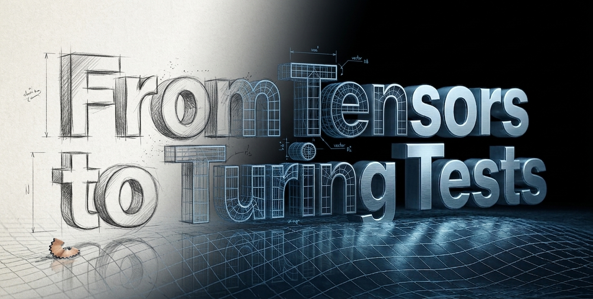

# From Tensors to Turing Tests



**From Tensors to Turing Tests** teaches generative AI and LLMs, theory and practice,
using a series of hands on guided activities called labs. This repo contains the tools and
starter code you will use. After you've cloned this repo, you should [install](#install)
and [verify](#verify) your environment as described below, and then [start the first
lab](#start-the-labs).

All the labs' model can be trained on a laptop GPU, or trained on a cloud GPU for less
than the [price of a candy bar](https://www.target.com/p/snickers/-/A-13055565). Most can,
with some patience, be done on a CPU. Linux, macOS, Windows (WSL recommended) are all
supported.

Follow the installations instructions for your platform below to [install
dependencies](#install-dependencies), [verify](#verify), and [start the
labs](#start-the-labs).

# Install Dependencies

Install the dependencies via `uv` (recommended) or `pip`. The specific command depends on
your platform:

## ⇨ You have a standard (i.e. CUDA) GPU

If you have a standard NVIDIA GPU, and have already installed the CUDA drivers,
installation is simple:

First, verify your CUDA install:
```bash
$ nvidia-smi
```
Versions 12, 13, or newer will work. If you haven't installed the CUDA drivers, see [WSL
instructions](https://docs.nvidia.com/cuda/wsl-user-guide/index.html) (also see
[Microsoft's
guide](https://learn.microsoft.com/en-us/windows/ai/directml/gpu-cuda-in-wsl)), [Ubuntu
(native)
instructions](https://documentation.ubuntu.com/server/how-to/graphics/install-nvidia-drivers),
and [General NVIDIA
instructions](https://docs.nvidia.com/datacenter/tesla/driver-installation-guide/).
    
* Important: Do *not* install a Linux NVIDIA driver inside WSL. Use the Windows driver
  above.

Then install the remaining dependencies via `uv` (pip-compatible but faster), which
automatically creates the `.venv` and runs inside it:
```shell-session
$ pipx install uv # If you haven't previously installed uv
# No need to manually create a .venv
$ uv sync --extra torch-cu126
```

Or, if you prefer, use `pip`:
```shell-session
$ python -m venv .venv
$ source .venv/bin/activate
(.venv) $ pip install -r requirements-cu126.txt
(.venv) $ pip install -e . # Allows running tools like `ft4`
```

## ⇨ You don't have any GPU

You can run this course without any GPU. Each model has adjustable size and datasets, and
if you keep them small, they'll run on a CPU. Output may not be impressive, but so what?

Via `uv`:
```shell-session
$ pipx install uv # If you haven't previously installed uv
$ uv sync --extra torch-cpu
```

Or via `pip`:
```shell-session
$ python -m venv .venv
$ source .venv/bin/activate
(.venv) $ pip install -r requirements-cpu.txt
(.venv) $ pip install -e . # Allows running tools like `ft4`
```

## ⇨ You're running on a cloud GPU

Cloud GPUs, such as [RunPod](https://www.runpod.io), usually include a system-wide PyTorch
you can use.

Via `uv`:
```shell-session
$ pip install --no-cache-dir uv            # If you haven't previously installed uv
$ uv venv --system-site-packages           # Tell uv to use the system-wide packages
$ uv sync --extra torch-external --inexact # and not to install PyTorch separately
```

Or via `pip`:
```shell-session
$ python -m venv --system-site-packages .venv # Allow the venv to use the system-wide packages
$ source .venv/bin/activate
(.venv) $ python -m pip install -r requirements-external.txt
(.venv) $ pip install -e . # Allows running tools like `ft4`
```
You can use the provided `tools/container-setup.sh` to automatically setup the Cloud GPU
and pull your code.

## ⇨ You have a AMD ROCm, Intel GPU, Apple Silicon, or other non-standard GPU

Manually install the appropriate PyTorch. See https://pytorch.org/get-started/locally/ .

Via `pip`:
```bash
$ python -m venv .venv
$ source .venv/bin/activate
# Install PyTorch manually. Afterwards:
(.venv) $ python -m pip install -r requirements-external.txt
(.venv) $ pip install -e . # Allows running tools like `ft4`
```

---

# Verify

Verify your environment:
```bash
$ source .venv/bin/activate
(.venv) $ python ./tools/verify_environment.py
```

Or, if you used `uv`, just do `uv run` (no need to manually activate the `.venv`):
```bash
$ uv run ./tools/verify_environment.py
```

Finally, run `pytest`. You should see something like this:
```bash
$ source .venv/bin/activate
(.venv) $ pytest -q
..................................................                         [100%]
52 passed in 12.01s
```

---

# Start the Labs

Congratulations! Now begin the [course](https://ft4.ai/course/unit1) and start [Lab 0](https://ft4.ai/course/unit1/lab0):
```bash
# You can also invoke these with `-h` to see help
$ ./startnextlab            # Starts unit1.lab0
$ ./whichlab                # Which lab are you in?
$ pytest --only-lab         # Run tests for this lab only
$ grep -r 'TODO-LAB' src    # Finds code for you to write
```

The course and lab guides are at https://ft4.ai. Start with [Unit
1 Concepts](https://ft4.ai/course/unit1), then proceed to [Lab
0](https://ft4.ai/course/unit1/lab0).

If you have feedback, questions, or PRs, please share them. I'll do my best to respond on
a timely basis.
